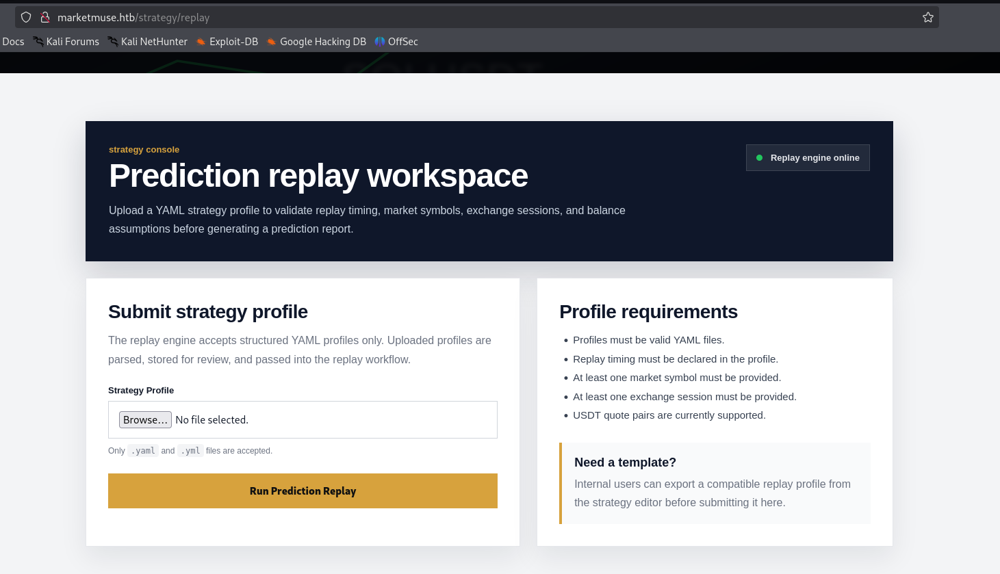
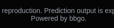
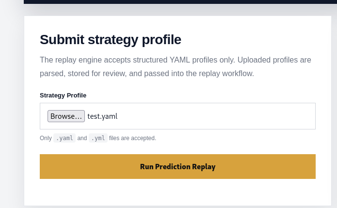
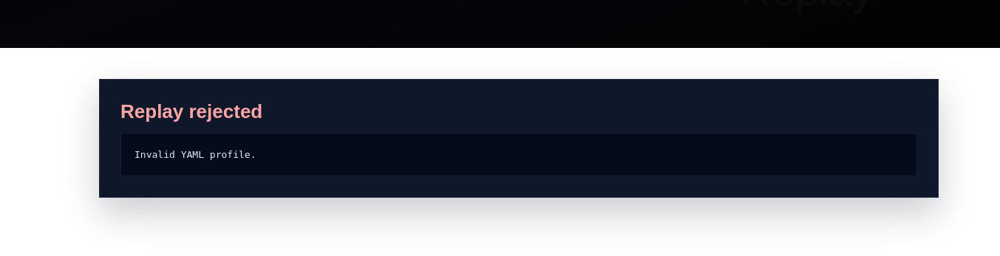
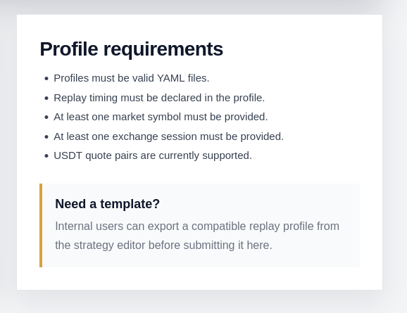
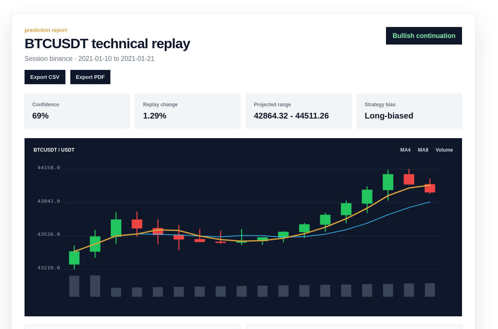
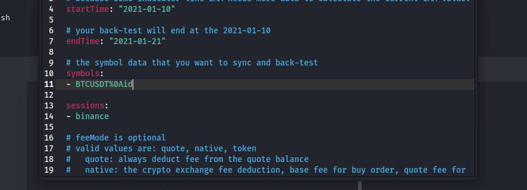
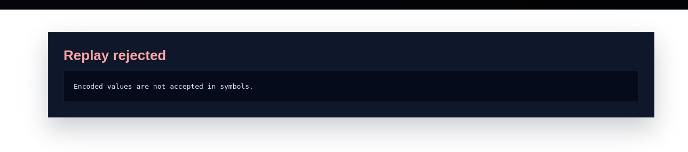
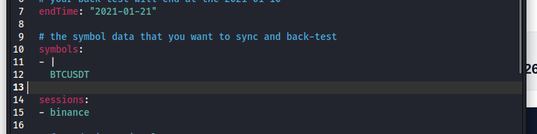

# [Machine Name]

## Introduction

[Include why you made this box, what skills and vulnerabilities you wanted to highlight, etc]

## Info for HTB

### Access

Passwords:

| User  | Password                            |
| ----- | ----------------------------------- |
| bbgo | NotMeantToBeCracked9882/ |
| root  | NotMeantToBeCracked765/ |

### Key Processes

- nginx: public web server on TCP/80, reverse proxies to the local Flask app on 127.0.0.1:5000.
- marketmuse.service: custom Flask web app running as user bbgo.
  - Source: /opt/marketmuse/app/app.py
  - Upload/report paths: /opt/marketmuse/uploads/ and /opt/marketmuse/reports/
- /usr/local/bin/marketmuse-preflight: custom preflight helper used before replay execution. Intentionally vulnerable through unsafe shell command construction.
- /usr/local/bin/market-replay-runner: thin wrapper around /usr/local/bin/bbgo.
- /usr/local/bin/bbgo: local BBGO-style mock CLI used for the backtest workflow.
- Custom Go strategy workspace: /opt/trading-engine/custom-strategies/

No intentionally vulnerable third-party versions are used. The intended vulnerabilities are custom logic flaws.

### Automation / Crons

Root cron: */2 * * * * root /usr/local/bin/bbgo-strategy-rebuild

Purpose: simulates an internal strategy rebuild pipeline.

Relevant files:

- /etc/cron.d/strategy-rebuild
- /usr/local/bin/bbgo-strategy-rebuild
- /opt/trading-engine/custom-strategies/

Behavior:

- Runs as root every 2 minutes.
- Enters /opt/trading-engine/custom-strategies.
- Runs go generate ./...
- Builds /opt/trading-engine/bin/strategy-runner.
- Logs to /var/log/bbgo/strategy-rebuild.log.

This is intentionally used for privilege escalation: bbgo can modify Go strategy source files, and root runs go generate ./... in that writable tree.

### Firewall Rules

No custom firewall rules.

Expected exposed service:

- TCP/80: Nginx / MarketMuse web app

The Flask app listens only locally on 127.0.0.1:5000.

### Docker

Docker is not used.


# Writeup


# Enumeration

I'll start enumeration with a basic nmap scan for all services and versions.

```bash
sudo nmap -p- -sVC marketmuse.htb
```
````
Starting Nmap 7.95 ( https://nmap.org ) at 2026-06-07 11:04 EDT
Nmap scan report for marketmuse.htb (192.168.50.158)
Host is up (0.00069s latency).
Not shown: 65533 closed tcp ports (reset)
PORT   STATE SERVICE VERSION
22/tcp open  ssh     OpenSSH 9.6p1 Ubuntu 3ubuntu13.16 (Ubuntu Linux; protocol 2.0)
| ssh-hostkey: 
|   256 f8:7a:bb:63:3d:9b:98:84:42:18:53:66:e8:13:d7:4d (ECDSA)
|_  256 74:48:d3:3b:af:88:92:f5:9e:14:80:e9:42:06:98:bd (ED25519)
80/tcp open  http    nginx 1.24.0 (Ubuntu)
|_http-server-header: nginx/1.24.0 (Ubuntu)
|_http-title: MarketMuse | Strategy Prediction Replay
MAC Address: 00:0C:29:63:23:DF (VMware)
Service Info: OS: Linux; CPE: cpe:/o:linux:linux_kernel
````
We have two very common ports, port 80 to what seems to be a web application and port 22, ssh.

I'll ran a quick feroxbuster scan while I review the webpage, however, it doesn't show anything interesting.

```bash
feroxbuster -u http://marketmuse.htb -w /usr/share/wordlists/seclists/Discovery/Web-Content/big.txt
```
````
404      GET        5l       31w      207c Auto-filtering found 404-like response and created new filter; toggle off with --dont-filter
200      GET       20l      101w     1312c http://marketmuse.htb/static/market-hero.svg
200      GET      828l     1637w    21585c http://marketmuse.htb/strategy/replay
200      GET       17l       76w      968c http://marketmuse.htb/static/market-footer.svg
200      GET      821l     1635w    21497c http://marketmuse.htb/
[####################] - 34s    20484/20484   0s      found:4       errors:0      
[####################] - 33s    20479/20479   619/s   http://marketmuse.htb/
````

The webpage seems to be aimed to users with knowledge on market and strategies.


Exploring /strategy/replay, the application provides a strategy replay workspace where users can upload YAML profiles and generate market study reports with technical replay metrics, projections, etc...



Also, in the footer of the webpage we can see it's powered by bbgo, a Go crypto strategy backtesting framework. In this case it's seems to be used alongside the uploaded yaml file to get the metrics and projections.



# Foothold

Knowing that bbgo is running in this webapp, we can potentially look for any cve's or known vulnerabilities, but this won't be helpful.

The next step is the upload hability implemented. If we try to upload any content and name it with the extension .yaml, we'll get an error





The webapp is actually parsing the files and it seems to be checking for a specific structure in them. We can get an idea of what it's asking from the webapp



To get an example of a valid .yaml stating a profile, we can search for bbgo .yaml profiles and see how they're structured.

Inside bbgo's repository we can get this example:

````
backtest:
  # your back-test will start at the 2021-01-10, be sure to sync the data before 2021-01-10 
  # because some indicator like EMA needs more data to calculate the current EMA value.
  startTime: "2021-01-10"

  # your back-test will end at the 2021-01-10
  endTime: "2021-01-21"
  
  # the symbol data that you want to sync and back-test
  symbols:
  - BTCUSDT

  sessions:
  - binance
  
  # feeMode is optional
  # valid values are: quote, native, token
  #   quote: always deduct fee from the quote balance
  #   native: the crypto exchange fee deduction, base fee for buy order, quote fee for sell order.
  #   token: count fee as crypto exchange fee token
  # feeMode: quote
  
  accounts:
    # the initial account balance you want to start with
    binance: # exchange name
      balances:
        BTC: 0.0
        USDT: 10000.0
````

I'll save this as a .yaml file and upload it to the webapp. This time it gives us a different output



We get a chart and other different metrics for the profile we just submitted. We also have the functionality to export our results to cve or pdf. It doesn't seem to be a vulnerability around that cve or pdf export, so I'll focus on the yaml file.

We can try an encoded value and see if it works





It seems like some sort of filtering is happening in the back. 

To try and bypass these filters, we can use yaml syntax. A scalar "|" allows us to breaklines, we can try that with a valid value.




It's valid, we could try a payload now


It seems the filter is still being applied.


In the collection "sessions" however, we can try the same syntax and the yaml would load


And I receive a call on my kali


# Lateral Movement (optional)

[Describe the steps for lateral movement. This can include Docker breakouts / escape-to-host, etc.]

# Privilege Escalation

[Describe the steps to obtaining root/administrator privileges on the box.]
